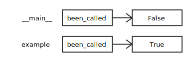

# 全局变量

如果你试图对一个全局变量重新赋值，结果可能出乎意料。你运行它，你会发现 been_called 的值并未发生改变。问题在于 example 生成了 一个新的被称作 been_called 的局部变量。当函数结束的时候，该局部变量也消失了，并且对全局变量没有影响。

```python
been_called = False


def example1():
    been_called = True  # WRONG
```



要在函数内对全局变量重新赋值，你必须在使用之前声明 (declare) 该全局变量。

```python
been_called = False


def example2():
    global been_called  # declare
    been_called = True
```

如果全局变量是可变的，你可以不加声明地修改它：

```python
known = {0: 0, 1: 1}


def example3():
    known[2] = 1
```

但是如果你想对变量重新赋值，你必须声明它：

```python
def example4():
    global known
    known = dict()
```
