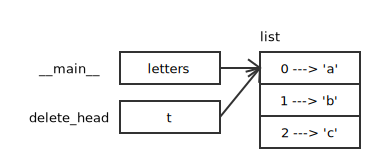
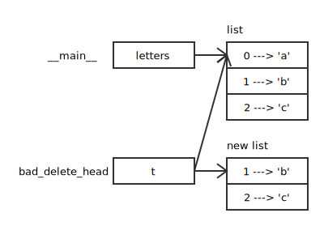

# 列表参数

当你将一个列表作为参数传给一个函数，函数将得到这个列表的一个引用。如果函数对 这个列表进行了修改，会在调用者中有所体现。

```python
def delete_head(t):
    del t[0]


letters = ['a', 'b', 'c']
delete_head(letters)
print(letters)              # ['b', 'c']
```



虽然 letters 和 t 的地址不同，但是 del 直接操作 list 所以修改最终作用于 letters。这个是什么意思呢？让我们看一下下面的例子。

```python
def bad_delete_head(t):
    t = t[1:]               # WRONG!


letters = ['a', 'b', 'c']
bad_delete_head(letters)
print(letters)              # ['a', 'b', 'c']
```

同样是删除首元素，为什么第二个方法失败了呢？

原来，将列表作为参数传给这个函数时，函数得到的依然是这个列表的一个引用，但是在进行 t[1:] 操作时，创建了一个新的 list 并让 t 指向了新的 list，所以修改的结果并没有作用于 letters。



那有什么解决的方法呢？直接的方法是，将新的 list 作为返回值传递给 letters，让 letters 指向新的 list。

```python
def tail(t):
    return t[1:]


letters = ['a', 'b', 'c']
letters = tail(letters)
print(letters)              # ['b', 'c']
```

# Reference

[像计算机科学家一样思考 Python (第 2 版)](https://book.douban.com/subject/26870407/)
